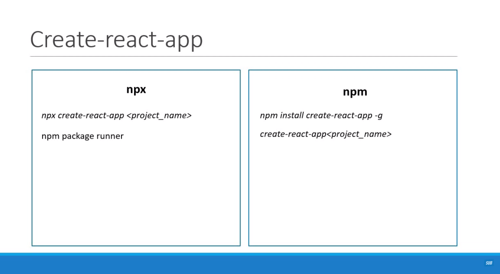
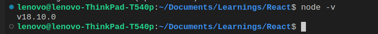
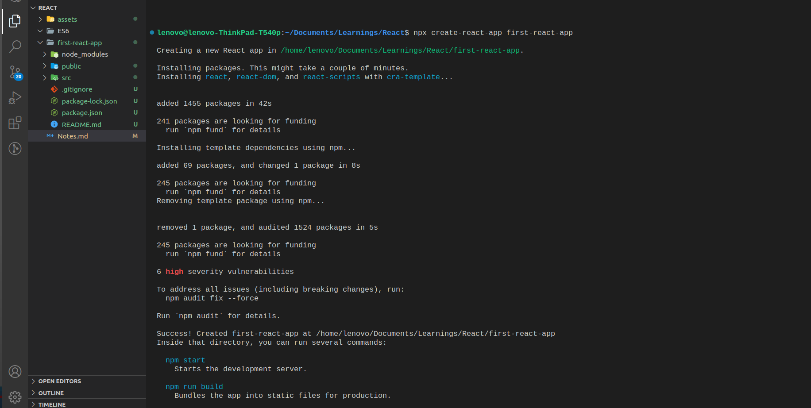
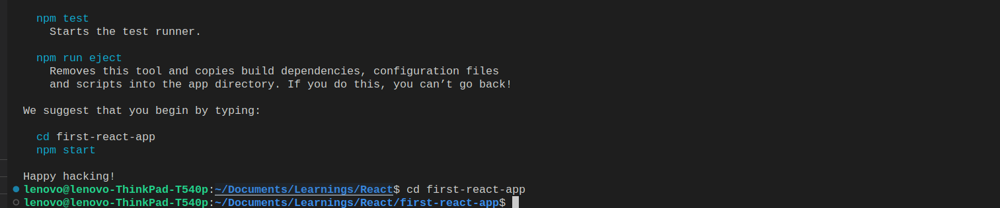
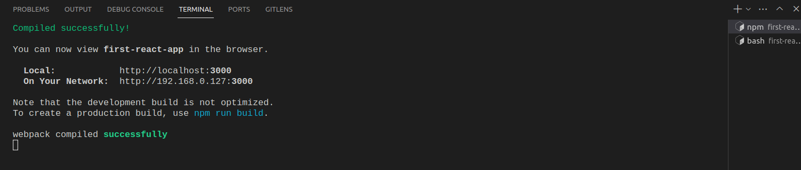
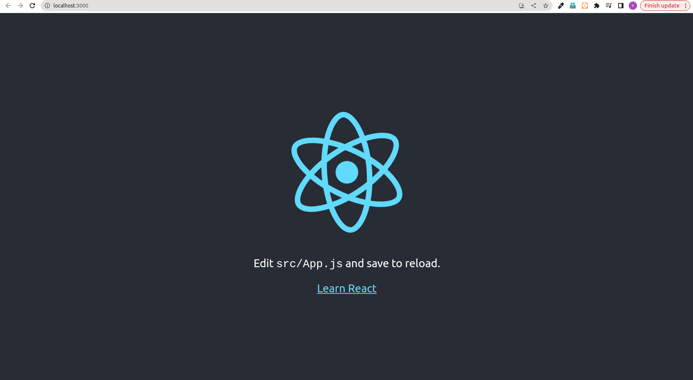
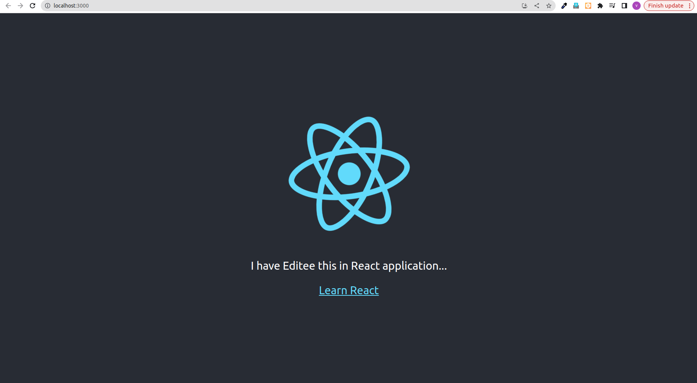

# React Tutorial notes

# Introduction

# What is React ?

- React is the opensource javascript library for building user interfaces.

* As per the above sentence, React is not a Framework it is Library.

```
Difference between Library and Framework:

A framework is a set of pre-written code that provides a structure for developing software applications.
A library, on the other hand, is a collection of pre-written code that can be used to perform specific tasks.
```

- React does not focus on other aspects of applications which are routing, http and so on. It only focus on Building rich interfaces/UI.

* As react's Eco-system supports well with other libraries like routing and http, the implementation of routing,http are possible and easy in React.

# Why React ?

- Trust - React is a Project created and maintained by Facebook. So we can trust that it will not go down soon.

* Community Support - Huge community support is available. We can get support from stackoverflow like medium if we stuck somewhere.

- Partioning - It allows to partition the application into multiple parts in the name of components.

* Code Reusability - it allows to reuse code.

* Declarative - We want to just tell react what we want, react will build the actual UI.

* Efficient rendering - React will handle efficiently updating and rendinring of the components.

* DOM updates - DOM updates are handles gracefully in React.

* Integration with other application - we can seamlessly integtate react with other application either a specific portion or entire application.

* Supports react native - It supports to study react native with ease.

# Pre-Requisties

- Html , CSS and Java Script fundamentals.

- ES6

* Java script - "this" keyword , filter, map and reduce.

* ES6 - let and const, arrow functions , template literals , default paramaters, object literals , rest and spread operators and destructuring assignment.

# Refreshment on ES6 and typeScript

## javaScript this :

- In javascript, this keyword refers to Objects where it is used.

### 1. this inside global scope:

- Whenever a this keyword is used in global scope, It refres to the Window Object.

```
let a = this;
console.log(this)    // {}

this.name = 'vijay';
conosle.log(window.name)    // vijay

```

### 2. this inside functions:

- whenever we use this keyword inside functions, It refers to the window Object.

```
function check(){
console.log("this",this)
}

check();       // this { window .... }
```

### 3. this in constructor function:

- Constructor function is used to create new Objects.

- Whenever this keyword is used in a constructor function, it refers to the object where it is used.

```

function demo(){
    this.name = 'Vijay S';         // Here this refers to the Object.
    this.age = 22;
}

let obj1 = new demo();

console.log(obj1);              // { name : Vijay S ; age : 22 }
console.log(obj1.name)          // vijay S
```

### 4. this in Object method :

- whenever this keyword is used in method inside the this refers to the Object.

```
obj = {
    name: 'vijay S',
    age : 22,
    demo(){
        console.log(this);                 // { name: 'vijay S',age : 22 , demo : Fn }
        conosle.log(this.age)              // 22
    }
}

obj.demo();

```

### 5. this inside inner function

- whenever this keyword is used inside an inner function of a method , it refers to the Window Object.

```

obj = {
    name: 'vijay S',
    age : 22,
    demo(){
        console.log(this);                 // { name: 'vijay S',age : 22 , demo : Fn }
        conosle.log(this.age)              // 22

        function inner(){
            console.log(this);             // { window Object .. }
            console.log(this.age)          // undefined
        }

        inner();
    }
}

obj.demo();

```

### 6. this inside arrow function:

- Whenever this keyword is used in an arrow function, it refers to the parent scope of the arrow function.

* Example 1:

```

const demo = () => {
    console.log(this)         // { Window Object ... }   Here demo function's parent scope is only window object
}

demo();
```

- Example 2 :

```
const obj1 = {
    name : 'vijay S',
    age :22 ,

    sayHello(){
        let hi = () => {
            console.log(this);          // { name : 'vijay S', age : 22,  sayHello : Fn}
            console.log(this.age)       // 22
        }
        hi();
    }
}

obj1.sayHello();
```

# [].map() :

- map is an higher order function ( A functions that takes another function as an argument or A function that returns another function ).

- It usually used to tranformm the array.

- it creates entirely new array.

## Example :

```

const array1 = [ 1,2 ,3 ,4, 5];

const tranformedArray = array1.map( (ele) =>  ele*2  )           // map function can have arrow function / anonymous function also.

console.log(tranformedArray)    // [2,4,6,8,10]

```

# [].filter() :

- filter is also an higher order function.

* It is used to filter an array based on a condition.

* It creates a new array with only filtered values based on a provided condition.

## Example:

```
const arry = [ 1,2,3,4,5];

const filteredArray = array.filter(function(x){ return x%2 ===0 })   // condition only to filter Even numbers from the Array

console.log(filterdArray);        // [2,4]
```

# [].reduce() :

- reduce is also an higher order function.

- This function is used to reduce an existing array to a single value by processing those array elements.

- This functions get two parameters. First one is function and second one is initial acculator value. The first argument function is responsible for logic which we is used to reduce the array. This function also takes two parameters. one is accumulator and current value.

## Example : Finding Max number in an array using reduce :

```

const array = [ 100 , 22, 300 , 450, 1000];

let maximumnumber = array.reduce( (accumulator,currentValue) => {
if(currentValue >  accumulator){
accumulator = currentValue
}
return accumulator
} ,0)

console.log(maximumnumber)          // 1000
```

## Transpilers:

- Every browsers does not support the ES6 ( ECMA Script 2015 ). So , the transpilers compiles the ES5 to normal ECMA Script which browsers should understand.

* Typescript is also the transpilers.

# Creating first React Application:

## Pre-requesties to create an React Application:

- node
- Text Editor - VS code

## Approaches to create an React application:

- Basically there are two aproaches are available to create an react application.They are:

  - 1. npx create-react-app command line interface approach
  - 2. installing the create-react-app npm package approach

1. npx approach :

   - npx is the npm package runner which gets installed when we install node.

   * So, we are directly able to run the create-react-app command and project is created by npx.

2. npm approach :

   - In this method create-react-app npm package should be installed globally.

   * Once the npm package is installed then react app should be created using command.



## Step by Step guide to create an angular application using npx approach:

step 1: install node / If already installed update and confirm the node version which you use using below command:

        node -v



Step 2: move to the directory where you want to create an React application.

Step 3: In the terminal, run the below command:

         npx create-react-app <your-react-app-name>

        A react application will be created in the provided name as below image shows.



Step 4: Move to the newly created react application's directory:

        cd <new-react-app-name>



Step 5: Run the React application using the below command:

        npm start

Once you type the command in terminal the react-app will get start running and in the browser, the application will be opened in the 3000 port in localhost





Step 6: As mentioned in the running application Edit in App.Js file in your application and save. You can see the changes reflecting in the browser.


