# React Tutorial notes

# Introduction

# What is React ?

- React is the opensource javascript library for building user interfaces.

* As per the above sentence, React is not a Framework it is Library.

```
Difference between Library and Framework:

A framework is a set of pre-written code that provides a structure for developing software applications.
A library, on the other hand, is a collection of pre-written code that can be used to perform specific tasks.
```

- React does not focus on other aspects of applications which are routing, http and so on. It only focus on Building rich interfaces/UI.

* As react's Eco-system supports well with other libraries like routing and http, the implementation of routing,http are possible and easy in React.

# Why React ?

- Trust - React is a Project created and maintained by Facebook. So we can trust that it will not go down soon.

* Community Support - Huge community support is available. We can get support from stackoverflow like medium if we stuck somewhere.

- Partioning - It allows to partition the application into multiple parts in the name of components.

* Code Reusability - it allows to reuse code.

* Declarative - We want to just tell react what we want, react will build the actual UI.

* Efficient rendering - React will handle efficiently updating and rendinring of the components.

* DOM updates - DOM updates are handles gracefully in React.

* Integration with other application - we can seamlessly integtate react with other application either a specific portion or entire application.

* Supports react native - It supports to study react native with ease.

# Pre-Requisties

- Html , CSS and Java Script fundamentals.

- ES6

* Java script - "this" keyword , filter, map and reduce.

* ES6 - let and const, arrow functions , template literals , default paramaters, object literals , rest and spread operators and destructuring assignment.

# Refreshment on ES6 and typeScript

## javaScript this :

- In javascript, this keyword refers to Objects where it is used.

### 1. this inside global scope:

- Whenever a this keyword is used in global scope, It refres to the Window Object.

```
let a = this;
console.log(this)    // {}

this.name = 'vijay';
conosle.log(window.name)    // vijay

```

### 2. this inside functions:

- whenever we use this keyword inside functions, It refers to the window Object.

```
function check(){
console.log("this",this)
}

check();       // this { window .... }
```

### 3. this in constructor function:

- Constructor function is used to create new Objects.

- Whenever this keyword is used in a constructor function, it refers to the object where it is used.

```

function demo(){
    this.name = 'Vijay S';         // Here this refers to the Object.
    this.age = 22;
}

let obj1 = new demo();

console.log(obj1);              // { name : Vijay S ; age : 22 }
console.log(obj1.name)          // vijay S
```

### 4. this in Object method :

- whenever this keyword is used in method inside the this refers to the Object.

```
obj = {
    name: 'vijay S',
    age : 22,
    demo(){
        console.log(this);                 // { name: 'vijay S',age : 22 , demo : Fn }
        conosle.log(this.age)              // 22
    }
}

obj.demo();

```

### 5. this inside inner function

- whenever this keyword is used inside an inner function of a method , it refers to the Window Object.

```

obj = {
    name: 'vijay S',
    age : 22,
    demo(){
        console.log(this);                 // { name: 'vijay S',age : 22 , demo : Fn }
        conosle.log(this.age)              // 22

        function inner(){
            console.log(this);             // { window Object .. }
            console.log(this.age)          // undefined
        }

        inner();
    }
}

obj.demo();

```

### 6. this inside arrow function:

- Whenever this keyword is used in an arrow function, it refers to the parent scope of the arrow function.

* Example 1:

```

const demo = () => {
    console.log(this)         // { Window Object ... }   Here demo function's parent scope is only window object
}

demo();
```

- Example 2 :

```
const obj1 = {
    name : 'vijay S',
    age :22 ,

    sayHello(){
        let hi = () => {
            console.log(this);          // { name : 'vijay S', age : 22,  sayHello : Fn}
            console.log(this.age)       // 22
        }
        hi();
    }
}

obj1.sayHello();
```

# [].map() :

- map is an higher order function ( A functions that takes another function as an argument or A function that returns another function ).

- It usually used to tranformm the array.

- it creates entirely new array.

## Example :

```

const array1 = [ 1,2 ,3 ,4, 5];

const tranformedArray = array1.map( (ele) =>  ele*2  )           // map function can have arrow function / anonymous function also.

console.log(tranformedArray)    // [2,4,6,8,10]

```

# [].filter() :

- filter is also an higher order function.

* It is used to filter an array based on a condition.

* It creates a new array with only filtered values based on a provided condition.

## Example:

```
const arry = [ 1,2,3,4,5];

const filteredArray = array.filter(function(x){ return x%2 ===0 })   // condition only to filter Even numbers from the Array

console.log(filterdArray);        // [2,4]
```

# [].reduce() :

- reduce is also an higher order function.

- This function is used to reduce an existing array to a single value by processing those array elements.

- This functions get two parameters. First one is function and second one is initial acculator value. The first argument function is responsible for logic which we is used to reduce the array. This function also takes two parameters. one is accumulator and current value.

## Example : Finding Max number in an array using reduce :

```

const array = [ 100 , 22, 300 , 450, 1000];

let maximumnumber = array.reduce( (accumulator,currentValue) => {
if(currentValue >  accumulator){
accumulator = currentValue
}
return accumulator
} ,0)

console.log(maximumnumber)          // 1000
```

## Transpilers:

- Every browsers does not support the ES6 ( ECMA Script 2015 ). So , the transpilers compiles the ES5 to normal ECMA Script which browsers should understand.

* Typescript is also the transpilers.

# Creating first React Application:

## Pre-requesties to create an React Application:

- node
- Text Editor - VS code

## Approaches to create an React application:

- Basically there are two aproaches are available to create an react application.They are:

  - 1. npx create-react-app command line interface approach
  - 2. installing the create-react-app npm package approach

1. npx approach :

   - npx is the npm package runner which gets installed when we install node.

   * So, we are directly able to run the create-react-app command and project is created by npx.

2. npm approach :

   - In this method create-react-app npm package should be installed globally.

   * Once the npm package is installed then react app should be created using command.


## Step by Step guide to create an angular application using npx approach:

step 1: install node / If already installed update and confirm the node version which you use using below command:

        node -v


Step 2: move to the directory where you want to create an React application.

Step 3: In the terminal, run the below command:

         npx create-react-app <your-react-app-name>

        A react application will be created in the provided name as below image shows.


Step 4: Move to the newly created react application's directory:

        cd <new-react-app-name>


Step 5: Run the React application using the below command:

        npm start

Once you type the command in terminal the react-app will get start running and in the browser, the application will be opened in the 3000 port in localhost


Step 6: As mentioned in the running application Edit in App.Js file in your application and save. You can see the changes reflecting in the browser.


# React Application Folder Structure

- When we create an React application, a brand new appication is created and have some files and folders as default as below:

- There are three folders and four files under application's-root-directory as below:

  - node-modules Folder
  - public Folder
  - src Folder

  - .gitignore File
  - package-lock.json File
  - package.json File
  - README.md File


## Explanation on Files

### package.json

- package.json is a file which contains the dependencies and scripts for the project.

* It has the details like version of react application and scripts that runs,builds and even tests the react application.


### package-lock.json

- Based on the package manager we are using, the package-lock.json/ yarn-lock.json file will be available in the created application.

- This is only responsible for consistent installations of our dependencies like libraries/other npm packages.


### .gitignore and README.md

- .gitignore responsible to avoid the files which we don't want to upload in the repository.

- README.ms is a documentation file.

## Explanation on Folders

### node_modules Folder

- node_modules folder is the place where every dependencies of our application installed.

- This folder get created while we create a project using create-react-app command.

- if it is not created in that time, we can create it using npm i command.

- it is responsible to run the application with all installed dependencies.

### public Folder

- This folder contains six files.

- Among them favicon.ico , logo192.png , logo512.png , manifesr.json and roots.txt are nothing to deal with us. Few are just image files and remaining should not need to be discussed.

### index.html file in public folder

- index.html is one of the files under the public folder.

* This file is the only html page for the entire react application.

* It does not mean that we should not write another html pages than this.

* As a single-page application, this index.html will be dynamically changed.

* Basically we don't want to change any code in this index.html file.

* Because In the body tag, there is div element with id root.

* This div element is responsible for every page that appear in this application.


## src folder

Src folder is the part where every development will happen.

It has below files inside it:

- index.js

  index.js file is the starting point of react application.

  In this index.js file we specify the root component which is app component and the DOM element which will be controlled by react and the DOM element we specified is element with id as root ( div element in index.html file under public folder )

  So, In the react application app component is rendered inside the div element's DOM.


- App.js - App.js file is responsible for the view we see in the browser.

- App.css - App.css is responsible for styling the App component.

- App.test.js - It is for unit testing

- index.css - It is for styling the body of this application.

- logo.svg - It is just a image file.

- reportWebVitals.js

* setupTest.js

# React application control flow ( What happens when we run react application using npm start command in terminal ? )

- When we run the react application using the npm start command in terminal, the <b> index.html </b> file is served in the browser.

* index.html contains the root DOM node.

* Next, the control enters to the index.js file.

* In the index.js file, the ReactDOM renders the App component into the root DOM node.

* The App component contains the html which is displayed in the browser.

# Components

## Basics about components

- In React component refers the part of the User Inerface.

* components basically partition the entire application with multiple parts. For Example, For a basic application there may components like below image shows:


- Components are re-usable.

* A component can contain another component or components.

## Component in Code

- component is basically a java-script file or a file with .jsx extension. For Example App component refers to the App.js file.

* This file will conatin the detail of the component. But the component code will differ based on the component types.

## Component Types

- There are two types of components. They are:

  - Stateless Functional Components

  * Statefull Class Components.

### Stateless Functional Components:

- Functional components are simply a java-script functions which returns the HTML that describes UI.

- Example :

```
function example(componentType){
    return <h1> Hi I am Just Example for { componentType } ... </h1>;
}
```

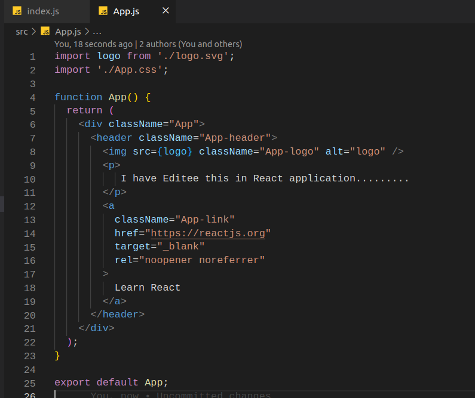

### Stateful Class Components:

- Class Components are normal ES6 classes that extends the React Component from react-library.

- This classmust have the render() method inside it.

- The render() method should return the HTML that describes the UI.

- Example:

```
import { Component } from { reactLibrary.. };

Class example extends Componment{
    render(){
        return <h1> Hi I am Just Example for { componentType } ... </h1>;
    }
}
```


<br>


# Functional Components in detail:

### Definition of functional component:

- A Functional component is a javascript function that accepts an input of properties and returns HTML that describes the UI.

### Creating the Functional component:

- A component is nothing but a javascript file. So, we can create a javascript file under src folder for our components.

- For component's naming convention we must use Pascel case.

* In the created file we must import React from react library as first step.

* Then we can create a function (also a Arrow Function) and that function should return neccessary HTML content we want in our component as below:

### FunctionalComponent.js file:

```
import React from 'react';

function FirstFunctionalComponent() {                      // Use pascel case otherwise it won't work.
    return <h1>I am first Functional Component...</h1>
}
```

- But this component is not connceted with the rest of our application.

* So we want to export this function from this component and need to import this in another component inorder to make this component where we want to use it.

* In the component where we import the component's function, It should be used as a HTML tag.

* If the component does not pass any props we can simply use that with self-closing tag.

### Example:

- I have exported the FirstFunctionalComponent and imported that in AppComponent as below:

### FirstFunctionalComponent.js:

```
import React from 'react';

function FirstFunctionalComponent() {
    return <h1>I am first Functional Component...</h1>
}

export default FirstFunctionalComponent;
```

### App.js:

```
import './App.css';
import FirstFunctionalComponent from './components/FunctionComponent';

function App() {
  return (
    <div className="App">
      {/* <FirstFunctionalComponent></FirstFunctionalComponent> */}
      <FirstFunctionalComponent/>
    </div>
  );
}

export default App;


```

# Exporting and Importing components:

- There are two types of exports available as below:

  default export.
  named export.

## Default export:

- default export means exporting something with default keyword.

- This default keyword allows us to import that in another file using another name we want.

- For example, consider that I am exporting a FirstFunctionalComponent function using default keyword FunctionComponent.js file as below:

### FunctionComponent.js:

```
import React from 'react';

const FirstFunctionalComponent = () => <h1>First Functional component using Arrow function...</h1>

export default FirstFunctionalComponent;
```

- And importing that FirstFunctionalComponent in a AppComponent using a name Demo in App.js file as below:

### App.js:

```
import './App.css';
import Demo from './components/FunctionComponent';       // Used Demo as a new name...

function App() {
  return (
    <div className="App">
      <Demo/>
    </div>
  );
}

export default App;

```

- It works fine as expected.

## Named Export:

- Named export means exporting something directly with export keyword.

- This method won't allow us to change the name of that whereever we import. So, We must use the same name for exporting and importing.

- For Example, I have tried exporting the FirstFunctionalComponent Function directly in FunctionComponent.js file and imported in the App.js file It throws error as below:


- So when we use named exports for something we should import that with same name.

# Class components in detail:

### Definition of Class component:

- Class components are basically a ES6 classes.

- As functional components, Class components optionally receives props and return null or HTML (JSX)

* It maintains the state which is private to the particular class component.

### Creating a Class component:

- First, You need to create a file with .js extension with valid component name using Pascel case.

- In that created component, we need to import React and Component from React library.

* Then, you need to create a ES6 class with valid component name.

* In order to make that normal class as a react library class, you need to extend the class using extends keyword with Component which we imported from react library.

* The class must contain render() method which should retuen HTML / null.

* As the created Class Component has no connection in DOM, we need to export it first.

* Later, we can utilize this component by importing this class wherever we want as an HTML tag.

### Example :

### ClassComponent.js:

```
import React, { Component } from 'react';

class ClassComponent extends Component{
    render() {
        return <h1>Hi I am first Class Component..</h1>
    }
}

export default ClassComponent;
```

### App.js :

```
import './App.css';
import ClassComponent from './components/ClassComponent';
import FirstFunctionalComponent from './components/FunctionComponent';

function App() {
  return (
    <div className="App">
      <FirstFunctionalComponent></FirstFunctionalComponent>
      <ClassComponent/>
    </div>
  );
}

export default App;

```

# JSX

- JSX ( Javascript XML ) - Extension to the javascript language syntax.

* With the React library It is extension to write XML like codes in elements and components.

* Just like XML JSX tags also have tag name , attributes and children.

* JSX is not necessary to write React code but JSX makes code simpler and elegant.

* JSXultimately transpiles topure javascript which is understood by the browsers.


- We can work with React by not using the JSX but with React.createElement method to create elements in DOM. But it is very difficult to use. When application grows large it will be unreadable and very complex.So JSX is playing a good role in React.

- JSX is typically done the CreateElement method by utilizing the React library.

- The below image shows the simple div and h1 tag without using JSX and using JSX.


- When I displayed both components in App.js as HTML tags, the browser looked like below image:


# props / properties:

- Properties are optional inputs that the component can accept.

* It also allows the component to be dynamic.

## handling Props in Functional Components:

### Passing Properties as attributes:

- As we know, we can reuse components multiple time as we need.

- So We can also pass properties to the components dynamically.

- If we want to pass some properties to components, the property need to be passed as Attributes in the component's tag of it's parent component. To understand this better, consider that we have a AppComponent and FunctionComponent and In AppComponent we have continuously display the FunctionComponent one by one but with different values. The values are usually props. The props should be paased as attributs of the HTML tag of the component which has been used in AppComponent.

- Consider that From AppComponent we want to pass the position to the FunctionalComponets wheather they are first, second or third. We can do it by creating attributes for the HTML tags to their components in AppComponent as below code snippet shows:

### App.js:

```
import "./App.css";
import FirstFunctionalComponent from "./components/FunctionComponent";

function App() {
  return (
    <div className="App">
      <FirstFunctionalComponent position="FIRST" />
      <FirstFunctionalComponent position="SECOND" />
      <FirstFunctionalComponent position="THIRD" />
    </div>
  );
}

export default App;

```

### Retrieving Properties in Components:

- As it is a functional Componets, we can retrieve as paramets. So, we should add parameters in the function of that FunctionalComponent.

- Then we can use the parameter in function body. We can see how a parameter look in a function body by consoling it as below:

### FunctionComponent.js :

```
import React from "react";

const FirstFunctionalComponent = (props) => {
  console.log("calls one time");
  console.log("props in FunctionComponent Function body", props);
  return <h1> I am the Functional Component...</h1>;
};
export default FirstFunctionalComponent;

```


- So, As above image shows the props are objects. So If we want to access them we can do it using '{}' notation as below:

### FunctionalComponent.js :

```
import React from "react";

const FirstFunctionalComponent = (props) => {
  return <h1> I am the {props.position} Functional Component... </h1>;
};
export default FirstFunctionalComponent;

```


### Handling Children Props in Functional Components:

- If we have to pass children tags for any component which means, When a component tag is used with another children tags inside it, the place where we pass those component props, we can retreive the children props too.

- For Example , In AppComponent I am passing the children tags for FunctionalComponent as below:

### App.js:

```
import "./App.css";
import FirstFunctionalComponent from "./components/FunctionComponent";

function App() {
  return (
    <div className="App">
      <FirstFunctionalComponent position="FIRST">
        <p>I am the Para tag children for FirstFunctionalComponent.</p>
      </FirstFunctionalComponent>
      <FirstFunctionalComponent position="SECOND" />
      <FirstFunctionalComponent position="THIRD" />
    </div>
  );
}

export default App;

```

- If I want to use that in the FirtFunctionalComponent , I should call that as .children method as below:

### FunctionComponent.js :

```
import React from "react";

const FirstFunctionalComponent = (props) => {
  return (
    <div>
      <h1> I am the {props.position} Functional Component... </h1>
      {props.children}
    </div>
  );
};
export default FirstFunctionalComponent;

```

- The output may look like below:


## Handling props in Class Components:

### passing properties as attributes:

- Irrespective of Component Types (FunctionalComponent , ClassComponent ), the props need to be sent in the same way which is via attributes.

- So, If the properties/pros should be sent as attributes in their html tag for both FunctionalCompoent and ClassComponent.

* For Example, If I am duplicating classComponents in AppComponent and tries to pass Props to each one , I should pass the props as attributes like below:

### App.js :

```
import "./App.css";
import ClassComponent from "./components/ClassComponent";
import FirstFunctionalComponent from "./components/FunctionComponent";

function App() {
  return (
    <div className="App">
      <ClassComponent value="1" />       // value is props here.
      <ClassComponent value="2" />
      <ClassComponent value="3" />
    </div>
  );
}

export default App;

```

### Retreiving the props in ClassComponents:

- Unlike FunctionalComponents ( where we specify the props as argument ) , The properties are available in `this.props` which is reserved in ClassComponent.

* So we can directly call the props by it's name like `this.props.propsName` as below:

### ClassComponent.js:

```
import React, { Component } from "react";

class ClassComponent extends Component {
  render() {
    return (
      <h1>Hi I am first Class Component and my valu is {this.props.value}</h1>
    );
  }
}

export default ClassComponent;

```

- We can see the result is obtained as FunctionalComponent trough the below image:

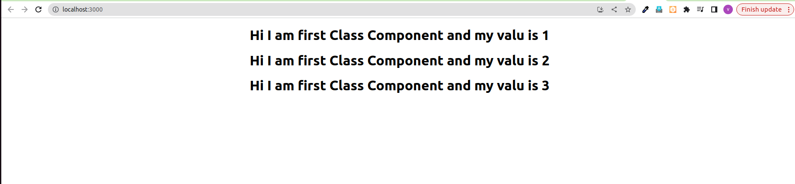

### Notes on props :

- props are immutable.
- We can pass more than one props.

# Component State:

- State is also like props which is have control on what is render on component.


## State Demo in ClassComponent:

- A state is noting but an Object that has privatrely maintained in the component.

* State influences what is render in the browser.

* State can be changed within the component.

### Example: Setting a initialState and change the state in click event in a ClassComponent as below:

### Step 1 : Creating State Object and initialization:

- The state is usually initialized inside the Class constructor.

* Inside the constructor `super()` method is required.

* Then We can simply call initialize the state object using `this.state` property.

* this.state is a reserved keyword. So, We can assign any object value using this.state keyword.

### State.js:

```
...

 constructor() {
    super();
    this.state = {
      message: "I am initial State",
    };
  }

...

```

### Step 2 : Binding state in render Function :

- We can easily bind the state of a componnet with it's render function using the `this.state` keyword as below:

### State.js :

```
import { Component } from "react";
import React from "react";

class StateComponent extends Component {
  constructor() {
    super();
    this.state = {
      message: "I am initial State",
    };
  }

  render() {
    return (
      <div>
        <h1> {this.state.message}</h1>
      </div>
    );
  }
}

export default StateComponent;

```

### Step 3 : Adding button in HTML :

- We can simply add a button tag in JSX as below:

### State.js :

```
import { Component } from "react";
import React from "react";

class StateComponent extends Component {
  constructor() {
    super();
    this.state = {
      message: "I am initial State",
    };
  }

  render() {
    return (
      <div>
        <h1> {this.state.message}</h1>
        <button> Subscibe</button>
      </div>
    );
  }
}

export default StateComponent;

```

### Step 4 : Changing the state using setState() methood :

- By adding the click eventhandler to the button, we can change the state to new state which we want using setState() method.

* setState() method accepts the new Object as argument which will be override the initial State.

### State.js :

```
import { Component } from "react";
import React from "react";

class StateComponent extends Component {
  constructor() {
    super();
    this.state = {
      message: "I am initial State",
    };
  }

  chageState() {
    this.setState({
      message: "Now you are subscribed with use !",
    });
  }

  render() {
    return (
      <div>
        <h1> {this.state.message}</h1>
        <button
          onClick={() => {
            this.chageState();
          }}
        >
          {" "}
          Subscibe
        </button>
      </div>
    );
  }
}

export default StateComponent;

```

# Do's and Don's in State:

### 1) Never modify the state directly.Instead make use of setState method

- if we don't use the setState method to modify the state, The reactcomponent will not rendered. So the UI will not get updated with the correct state value.

* Consider that we have a Counter Component, where the count value is increasedby a button click. The count value is maintained in state and the state value is changed using setState() method. If we directly change the state, the UI will not render in react.

### Counter.js:

```
import react, { Component } from "react";

class Counter extends Component {
  constructor() {
    super();
    this.state = {
      count: 0,
    };
  }

  increase() {
    // this.state.count = this.state.count + 1;                  // We should not do it like this

    // We should change the state using the setState method as below:
    this.setState({
      count: this.state.count + 1,
    });
  }

  render() {
    return (
      <div>
        <h1>I am Counter Component</h1>
        <p>Counter is : {this.state.count}</p>
        <button
          onClick={() => {
            this.increase();
          }}
        >
          Click to increase count
        </button>
      </div>
    );
  }
}

export default Counter;

```

### 2) passing callback function as second parameter to setState method.

- Whenever you need to execute some code after the state has been changed, should not place the code directly after the setState method.Instead pass the code within the callback function which is passed as a second argument to the setState method.

* Consider the same CounterComponent. In the increase method I have added a console statement which logs the count value. I have logged the count value in two different areas. One is After the setState method and another one is callback function of the setState method.

* The log in callback function returns the updated state and the another one returns the last state value as below:

### Counter.js :

```
import { Component } from "react";

class Counter extends Component {
  constructor() {
    super();
    this.state = {
      count: 0,
    };
  }

  increase() {
    this.setState(
      {
        count: this.state.count + 1,
      },
      // callback function as second argument within setState method ( Correct approach when something need to be done after updating the stae )
      () => {
        console.log("count inside the callback", this.state.count); // logs updated state
      }
    );

    console.log("count", this.state.count); // logs old state
  }

  render() {
    return (
      <div>
        <h1>I am Counter Component</h1>
        <p>Counter is : {this.state.count}</p>
        <button
          onClick={() => {
            this.increase();
          }}
        >
          Click to increase count
        </button>
      </div>
    );
  }
}

export default Counter;

```


### 3) When you want to update the state based on the previous state, use function as argument instead of normal Object as argument.

- The setState method usually accepts the Object as argument to modify the existing state. There is another way that is it also accepts the callback function as first argument which has the access to the previous value inside it. So we can access the previous value
  to update the state as below:

### Counter.js :

```
import { Component } from "react";

class Counter extends Component {
  constructor() {
    super();
    this.state = {
      count: 0,
    };
  }

  increase() {
    this.setState((previousState) => ({
      count: previousState.count + 1,
    }));
  }

  incrementFive() {
    this.increase();
    this.increase();
    this.increase();
    this.increase();
    this.increase();
  }

  render() {
    return (
      <div>
        <h1>I am Counter Component</h1>
        <p>Counter is : {this.state.count}</p>
        <button
          onClick={() => {
            // this.increase();
            this.incrementFive();
          }}
        >
          Click to increase count
        </button>
      </div>
    );
  }
}

export default Counter;

```

- It also accepts the props as second parameted to update state.

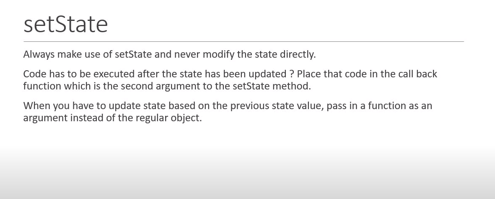

# Destructuring props and state:

- Destructuring is ES6 feature that is used to unpack the values from array / properties from objects into distinct variables.

* In React Destructuring the State and Props increases code-readability.

## Destructuring props in FunctionalComponent:

- Through AppComponent, props are passed to particular functionalComponent as below:

### App.js :

```
import "./App.css";
import FirstFunctionalComponent from "./components/FunctionComponent";

function App() {
  return (
    <div className="App">
      <FirstFunctionalComponent name="Robert" heroName="Iron Man" />   // name , heroName are props
    </div>
  );
}

export default App;

```

- Destructuring can be done in two different ways in FunctionalComponents:

- One is Destruncting it in FunctionalParameter itself.

### Destructuring in FunctionalParameter

- Instead of using props as parameter in FunctionalComponent, We should pass an Object with required prps name and then we just need to use the names directly inside the function body. We don't want to use props.propsName inside function body.

* We can see it in below image:


### Destructuring in Function body :

- In function body we must assign every props to a const variable at the beginning itself.

* After we can use the props without specifying the props keywork before it in function body.


## Class Component Destructuring:

- In ClassComponent, props and states should be destructured inside the render method as below:


# Event Handling:

- Event handling helps the user to interact efficiently with the UI like click, mouseover, key press and so on.

- In React Event Handling we must consider the following steps:

  1. The Event names must be camelCase.
  2. The Event functions must be used inside a curly bracs. ( No need to call functions just need to specify the function name)

## Handling very simple click Event in FunctionalComponent:

### FunctionClick.js :

```
import React from "react";

function FunctionClick() {
  function clickHandler() {
    console.log("Function click clicked!");
  }

  return (
    <div>
      <button onClick={clickHandler}> I am Function Click! Click ME</button>
    </div>
  );
}

export default FunctionClick;

```

## Handling very simple click Event in ClassComponent:

### ClassClick.js:

```
import React, { Component } from "react";

class ClassClick extends Component {
  clickHandler() {
    console.log("Class cliked well");
  }
  render() {
    return (
      <div>
        <button onClick={this.clickHandler}>I am Class !Click Me</button>
      </div>
    );
  }
}

export default ClassClick;

```

# Binding Event Handlers:

## Reason Why we need to Bind the Event handlers :

- Event Binding is necessary in React Components because, `this` keyword is undefined in the event handlers of components.

- In any component when we try to modify the component's state using the `this.state({})` method inside the EventHandler, `this` keyword inside the Eventhandler is undefind because of javascript functionality. To Overcome this issue Event Binding is came into picture in the React Component to modify the state in Event Handlers.

* Consider the below Example which only logs the `this` inside the EventHandler.

### EventBind.js:

```
import React, { Component } from "react";

class EventBind extends Component {
  constructor() {
    super();

    this.state = {
      message: "I am initial State Hello!",
    };
  }

  clickHandler() {
    console.log("this", this);
  }

  render() {
    return (
      <div>
        <div>{this.state.message}</div>
        <button onClick={this.clickHandler}>
          Click Me to Change the State{" "}
        </button>
      </div>
    );
  }
}

export default EventBind;

```

- When we click on the button, It returns the `undefined` value in consle as the below image shows.


## Various methods to Bind the Event Handlers:

- There are multiple ways to bind the Event Hanlders. They are :

* Binding in the render method.
* Use Arrow functions in render method.
* binding in the class constructor. ( Recommended approach )
* Class property as arrow Fnction.

### 1 ) Binding in the render method :

- In the render method Event Handler, We should bind the this keyword as below. So , the `this` keyword inside the Event Handler function has the value and we can change the state using this.setState() method as below example shows:

### EventBind.js :

```
import React, { Component } from "react";

class EventBind extends Component {
  constructor() {
    super();

    this.state = {
      message: "I am initial State Hello!",
    };
  }

  clickHandler() {
    console.log("this", this);
    this.setState({
      message: "I am changed to NEW STATE",
    });
  }

  render() {
    return (
      <div>
        <div>{this.state.message}</div>
        <button onClick={this.clickHandler.bind(this)}>          {/* appraoch 1 : Binding in render method */}
          Click Me to Change the State
        </button>
      </div>
    );
  }
}

export default EventBind;

```

### 2 ) Use Arrow Function render method :

- We can use Arrow Function in render method as follows to obtain the expected result.

### EventBind.js:

```
import React, { Component } from "react";

class EventBind extends Component {
  constructor() {
    super();

    this.state = {
      message: "I am initial State Hello!",
    };
  }

  clickHandler() {
    console.log("this", this);
    this.setState({
      message: "I am changed to NEW STATE",
    });
  }

  render() {
    return (
      <div>
        <div>{this.state.message}</div>
        {/* <button onClick={this.clickHandler.bind(this)}>
          Click Me to Change the State
        </button> */}

            <button onClick={() => this.clickHandler()}>                 { /*  approach 2 : Use Arrow Function in render method */}
          Click Me to Change the State
        </button>
      </div>
    );
  }
}

export default EventBind;

```

### 3 ) binding in the class constructor:

- This approach is provided in the official documentation.

- We should bind the Event Handler with this keyword in the constructor itself as below:

### EventBind.js :

```
import React, { Component } from "react";

class EventBind extends Component {
  constructor() {
    super();

    this.state = {
      message: "I am initial State Hello!",
    };

    this.clickHandler = this.clickHandler.bind(this); {  /* approach 3 : Binding in constructor */}
  }

  clickHandler() {
    console.log("this", this);
    this.setState({
      message: "I am changed to NEW STATE",
    });
  }

  render() {
    return (
      <div>
        <div>{this.state.message}</div>
        {/* <button onClick={this.clickHandler.bind(this)}>
          Click Me to Change the State
        </button> */}

        {/* <button onClick={() => this.clickHandler()}>
          Click Me to Change the State
        </button> */}

        <button onClick={this.clickHandler}>          {  /* approach 3 : Binding in constructor */}
          Click Me to Change the State
        </button>
      </div>
    );
  }
}

export default EventBind;

```

### 4 ) Class property as arrow Fnction :

- In this final approach, we can just write the event handler function as arow function to use the `this` keyword as below:

### EventBind.js:

```
import React, { Component } from "react";

class EventBind extends Component {
  constructor() {
    super();

    this.state = {
      message: "I am initial State Hello!",
    };
  }

  // clickHandler() {
  //   console.log("this", this);
  //   this.setState({
  //     message: "I am changed to NEW STATE",
  //   });
  // }

  // approach 4 : Event handler function as Arrow function
  clickHandler = () => {
    console.log("this", this);
    this.setState({
      message: "I am changed to NEW STATE",
    });
  };

  render() {
    return (
      <div>
        <div>{this.state.message}</div>
        {/* <button onClick={this.clickHandler.bind(this)}>
          Click Me to Change the State
        </button> */}

        {/* <button onClick={() => this.clickHandler()}>
          Click Me to Change the State
        </button> */}

        <button onClick={this.clickHandler}>
          Click Me to Change the State
        </button>
      </div>
    );
  }
}

export default EventBind;

```

# Methods as props ( Passing data from Parent Component to Child and viceversa ):

- Consider that we have a parentComponent and ChildComponent.

- If we want to call a method in parentComponent in it's ChildComponent we can acheive this by passing the method as Props in the Child Component's attribute.

- Consider the below codes for references:

### ParentComponent.js :

```
import React, { Component } from "react";
import ChildComponent from "./ChildComponent";

class ParentComponent extends Component {
  constructor(props) {
    super(props);

    this.state = {
      parentName: "Parent",
    };

    this.greetParent = this.greetParent.bind(this);
  }

  greetParent() {
    alert(`Hello ${this.state.parentName}`);
  }

  render() {
    return (
      <div>
        <h1> I am Parent Component</h1>
        <ChildComponent greetHandler={this.greetParent} />
      </div>
    );
  }
}

export default ParentComponent;

```

### ChildComponent.js :

```
import React from "react";

function ChildComponent(props) {
  return (
    <div>
      <div style={{ background: "green", padding: 10 }}>
        <p>I am child component!</p>
        <button onClick={props.greetHandler}>
          I am a button from Child Component. If you click on me , I will call a
          method in my parent component
        </button>
      </div>
    </div>
  );
}

export default ChildComponent;

```

- So it's how we can call the method which lies in parentComponent in the ChildComponent as props using the attributes.


## passing the parameter from Child to Parent in this method:

- If we want to pass any parameter to the method in parentComponent and we call it in the ChildComponent. We can do it by converting the eventHandling to `ArrowFunctions` which allows to pass arguments as below:

### ChildComponent.js:

```
import React from "react";

function ChildComponent(props) {
  return (
    <div>
      <div style={{ background: "green", padding: 10 }}>
        <p>I am child component!</p>
        <button onClick={() => props.greetHandler("Child")}>          // Using Arrow Function to pass argument to parentComponent.
          I am a button from Child Component. If you click on me , I will call a
          method in my parent component
        </button>
      </div>
    </div>
  );
}

export default ChildComponent;

```

- And We can receieve this argument as parameter in the parentComponent's method as below:

### ParentComponent.js:

```
import React, { Component } from "react";
import ChildComponent from "./ChildComponent";

class ParentComponent extends Component {
  constructor(props) {
    super(props);

    this.state = {
      parentName: "Parent",
    };

    this.greetParent = this.greetParent.bind(this);
  }

  greetParent(childName) {                                         // Receiving the the parameter from ChilderenComponent
    alert(`Hello ${this.state.parentName} from ${childName}`);
  }

  render() {
    return (
      <div>
        <h1> I am Parent Component</h1>
        <ChildComponent greetHandler={this.greetParent} />
      </div>
    );
  }
}

export default ParentComponent;

```


# Conditional Rendering:

- We need to render some UI based on conditions several times. In React, Conditional Rendering works same as the conditions work in javascript.

* There are four approaches to conditionally render UI in React application. They are as below:

  - if/else.

  * Element variables.

  * Ternary conditional operators.

  * Short circuit operator.

* Before we start to go inside the below approaches, lets first create a Component and a simple condition to work.

### Sample condition and Component :

- In the below UserGreeting.js component, we have isLoggedIn value. If the value is true then we need to display the `Hello User` text , If it is false then `Hello guest` text should be displayed.

- For this condition, let's see the how the below four approaches work.

UserGreeting.js :

```
import React, { Component } from "react";

class UserGreeting extends Component {
  constructor(props) {
    super(props);

    this.state = {
      isLoggedIn: true,
    };
  }

  render() {
    return (
      <div>
        <div>Hello user!</div>
        <div>Hello Guest!</div>
      </div>
    );
  }
}

export default UserGreeting;

```

## if/else approach conditional rendering:

- In if/else appraoch, we just need to use the condition inside the render method and based on the conditions, we need to return the required JSX to acheive the expected result.

### UserGreeting.js :

```
import React, { Component } from "react";

class UserGreeting extends Component {
  constructor(props) {
    super(props);

    this.state = {
      isLoggedIn: false,
    };
  }

  render() {
    if (this.state.isLoggedIn) {
      return <div>Hello user!</div>;
    } else {
      return <div>Hello Guest!</div>;
    }
  }
}

export default UserGreeting;

```

- But this approac has lot of duplication of code and render method should be crowded.

* We cannot use this if/else statements inside the JSX.

## Element Variables approach:

- This approach use javascript variables to store Elements.

* This also helps in rendering the entire component or the part of component.

* First of all, we must declare a variable inside a render method.

* Then,we must assign the variable with required elements based on the condtions.

* Finally, we must return the variable in the JSX.

* We can do it as below code snippet shows:

### UserGreeting.js :

```
import React, { Component } from "react";

class UserGreeting extends Component {
  constructor(props) {
    super(props);

    this.state = {
      isLoggedIn: true,
      //   isLoggedIn: false,
    };
  }

  render() {
    let message;

    if (this.state.isLoggedIn) {
      message = <div>Hello User !</div>;
    } else {
      message = <div>Hello Guest !</div>;
    }

    return <div>{message}</div>;
  }
}

export default UserGreeting;

```

## Ternary conditional operator approach:

- The advantage of this approach is we can use ternary operators inside the JSX.

* In this approch we can return the condition and the render elements as a format of ternary opearators.

* It is simple.

### UserGreeting.js:

```
import React, { Component } from "react";

class UserGreeting extends Component {
  constructor(props) {
    super(props);

    this.state = {
      //   isLoggedIn: true,
      isLoggedIn: false,
    };
  }

  render() {
    return this.state.isLoggedIn ? (
      <div> Hello User !</div>
    ) : (
      <div> Hellow Guest !</div>
    );
  }
}

export default UserGreeting;

```

## short circuit operator approach:

- This short circuit operator approach is used for a specific condition in a ternary operator approach.

* short circuit operator approach is only used when we want to render something or nothing.

* We can acheive this using the `&&` operator.

* We should return a statement which has the condition on leftside and uses `&&` operator and in the right side of the operator we should have the element we want to render when the specified condition is true. So , it will only render the element we want to show.

* If condition is failed, nothing will be displayed.

### UserGreeting.js :

```
import React, { Component } from "react";

class UserGreeting extends Component {
  constructor(props) {
    super(props);

    this.state = {
      isLoggedIn: true,
      // isLoggedIn: false,
    };
  }

  render() {
      return this.state.isLoggedIn && <div>Hello User !</div>;
  }
}

export default UserGreeting;

```

# list Rendering :

- when we develop an web-application most oftenly we should display the list like list of names, products and so on.

* As React is strongly relies on javascript , we should not need to learn new methods other than javascript.

* For Listing also we can utilize the javadcript `map` method.

* For example, If we just need to display the list of names in UI, we can acheive this using map function as below:

### NameList.js :

```
import React from "react";

function NameList() {
  const names = ["Vijay", "Ajith", "Surya"];

  return (
    <div>
      {names.map((name) => (
        <h2> {name}</h2>
      ))}
    </div>
  );
}

export default NameList;

```


- We can also keep the list logic outside the return statement as below for simplicity:

### NameList.js :

```
import React from "react";

function NameList() {
  const names = ["Vijay", "Ajith", "Surya"];
  const nameList = names.map((name) => <h2>{name}</h2>);
  return <div>{nameList}</div>;
}

export default NameList;

```

## Refactoring the Listing:

- if the list is typically a object with multiple properties, we may need to display only some of the properties and need to avoid remaining. In that cases we can handle the listing in a seperate component.

* Create a new Component to display the list. Pass the parameter to the new component.

### PersonComponent.ts :

```
import React from "react";

function PersonComponent({ person }) {
  return (
    <div>
      <p>
        I am {person.name} . I am {person.age} years old. I Know {person.skill}
      </p>
    </div>
  );
}

export default PersonComponent;

```

### NameList.js :

```
import React from "react";
import PersonComponent from "./PersonComponent";

function NameList() {
  const persons = [
    { name: "Vijay", age: 22, skill: "Angular" },
    { name: "Sanjay", age: 22, skill: "React and workpress" },
    { name: "kathish", age: 26, skill: "Python, nestjs , networking and etc" },
  ];
  const personList = persons.map((person) => (
    <PersonComponent person={person} />
  ));
  return <div>{personList}</div>;
}

export default NameList;

```

# Lists and Keys:

- When we render list of itimes, the react may throw an warning messge in console as below :


- This warning implies us to have a `key` which is unique property in the each child of list.

* So, where we iterate over the list Items and create the list item component, we shpu;ld add the `key` attribut assigned with the unique value (property) of the list inorder to avoid the warning in console.

* As name property is unique for all list item in the provided list in my example, I have passed a `key` attribute with that value as below example shows:

### NameList.js :

```
import React from "react";
import PersonComponent from "./PersonComponent";

function NameList() {
  const persons = [
    { name: "Vijay", age: 22, skill: "Angular" },
    { name: "Sanjay", age: 22, skill: "React and workpress" },
    { name: "kathish", age: 26, skill: "Python, nestjs , networking and etc" },
  ];
  const personList = persons.map((person) => (
    <PersonComponent key={person.name} person={person} />
  ));
  return <div>{personList}</div>;
}

export default NameList;

```


## Important on `key` property:

- `key` property is not accessale in the child component which means in the list item component (PersonComponent).

* if we try to access it in the child-component as below, it will throw an error in console as below:


- So we should not use the `key` attribute in child component. if we want we should access it with another attribute name.


# using `index` as `key` in List rendering :

- Let us consider we just have a string array and need ti display the strings as list (ex: nameList) as below code shows:

###Namelist.js :

```
import React from "react";
function NameList() {
  //   const persons = [
  //     { name: "Vijay", age: 22, skill: "Angular" },
  //     { name: "Sanjay", age: 22, skill: "React and workpress" },
  //     { name: "kathish", age: 26, skill: "Python, nestjs , networking and etc" },
  //   ];

  //   const personList = persons.map((person) => (
  //     <PersonComponent key={person.name} person={person} />
  //   ));

  const names = ["Vijay", "Ajith", "Surya"];

  const nameList = names.map((name) => <h2>{name}</h2>);

  return <div>{nameList}</div>;
}

export default NameList;

```

- In the above type of scenario, we are unale to identify the uniue property as it is not an Object. If we take the name as key , there is a possibility for duplication of name in the array/list.

- So in this situation, we can use the `index as the key` for the list rendering as below code shows:

### Namelist.js:

```
import React from "react";
function NameList() {

  const names = ["Vijay", "Ajith", "Surya"];

  const nameList = names.map((name, index) => <h2 key={index}>{name}</h2>);   // using index as key

  return <div>{nameList}</div>;
}

export default NameList;

```

# important Note in using `index` as `key` in React List rendering :

- usually we perform some operations on list like adding a new item to the list or removing any item from list. These kind of operations affects the values inside the array as we render the list usiing the index as key.

- And also the list details got affected whenever we the order of a list is changed like ascending and descending.

- So We cannot use the index and key on that situations.


# Styling React Components:

- There are four ways available to apply Styles for React components.They are:

  - CSS Stylesheets.

  * Inline Styling.

  * CSS Modules.

  * CSS in Js libraries.

## CSS Stylesheets:

- As usual, we should have the seperate css file .

- Then we need to import the css file in the component and use the required classes with `className` attribute.

* For example If we have a css file and a class as below:

### StyleSheet.css :

```
.primary{
    color:blue;
}
```

- We can apply the class in the Component as below :

### StyleSeet.js:

```
import React from "react";
import "./StyleSheet.css";             // import the css file in the component.

function StyleSheetComponent() {
  return (
    <div>
      <h1 className="primary"> I am Stylesheet Component</h1>       // attach the className attribute and define the class
    </div>
  );
}

export default StyleSheetComponent;

```

### Conditional styling using props:

- In the component the value which we consider for styling will be obtained as props as they have sent from their parent component through the attribute.

- So, before applying the style first we need to define the condition and assign that value to the `className` attribute in the element.

- For example, If the AppComponent is parent and that component sends the props as below:

### App.js:

```
import "./App.css";
import StyleSheetComponent from "./components/StyleSheet";

function App() {
  return (
    <div className="App">
      {
        <div>
          <StyleSheetComponent isPrimary={false} />     // Here isPrimary is value to the child
        </div>
      }
    </div>
  );
}

export default App;

```

- And we should retrieve the value as props in the SyleSheetComponent and do as below to apply the style conditionally for any element.

### StyleSheet.js :

```
import React from "react";
import "./StyleSheet.css";

function StyleSheetComponent(props) {
  let headingTextColor = props.isPrimary ? "primary" : "";      // Defining style conditionally using props
  return (
    <div>
        <h1 className={headingTextColor}> I am Stylesheet Component</h1> // Assigning the value to className attribute in required element.
    </div>
  );
}

export default StyleSheetComponent;

```

### Multiple classes:

- If we want to apply multiple classes on single element, we want to use template literals with `className` attribute and need to seperate the classes with space.

* If we need to use any variable instead of className , we must use that with $ sign as usual.

* For example, I need to apply the both classes in the StyleSheet.css :

### StyleSheet.css :

```
.primary{
    color:blue;
}

.big-header{
    font-size: 150px;
}

```

- We want to apply them both in the component like below :

### StyleSheet.js :

```
import React from "react";
import "./StyleSheet.css";

function StyleSheetComponent(props) {
  let headingTextColor = props.isPrimary ? "primary" : "";
  return (
    <div>
      <h1 className={`${headingTextColor} big-header`}>             // multiple classes applied with ` `.
        I am Stylesheet Component
      </h1>
    </div>
  );
}

export default StyleSheetComponent;

```

## Inline Styling :

- In React Inline styling is not specified as string. Instead it is specified with an object whose key is camelcased version of the style name and the value is usually a string.

* For example we can have a inline style as below :

```
const inlineStyleExample = {
  fontSize: '30px',                         // Here , font-size stylename is camelcased and value is normal string.
  backgroundColor: 'yellow',
  paddingTop: '10px'
}

```

- We can apply this inline style in the element we want using the style attribiute on the element as below:

### Inline.js :

```
import React from "react";

const inlineStyleExample = {
  fontSize: "30px", // Here , font-size stylename is camelcased and value is normal string.
  backgroundColor: "yellow",
  paddingTop: "10px",
};

function Inline() {
  return (
    <div>
      <h1 style={inlineStyleExample}>I am Inline...</h1>   {/* Inline style applied using style attribute  */}
    </div>
  );
}

export default Inline;

```

## CSS Modules :

- css Modules is partially similar to the noraml styleSheet appraoch.

- CSS modules feature is available only on react-scripts version 2 or higher.

* As CSS modules are also sepearte files for CSS , the naming convention need to be followed on the CSS module files. The name of the file should be extended with `.module.css`. For example, `appStyles.module.css` is a CSS module file.

* In the style sheets, there is no change. We can have styles as we usually do in the normal styleSheets as below:

### appStyles.module.css:

```
.new{
    color:green;
}

```

- To import the module styles in the component, we should use the named import like below ( importing the module styles in app component ):

### App.js :

```
import "./App.css";
import "./appStyles.css";                              // Normal styleSheet import
import styles from "./appStyles.module.css";          // CSS Module stylesheet import

function App() {
  return (
    <div className="App">
      {
        <div>
          <h1 className="normal"> I am normal </h1>                       // Applying normal CSS
          <h1 className={styles.new}>I am CSS module style</h1>           // Applying CSS module class
        </div>
      }
    </div>
  );
}

export default App;

```

## Advantage of using the CSS Modules:

- The classes are locally scoped by default.

* If a class is used in an component and if we try to use the same class in the childern component the CSS module classes won't allow it.

* The normal stylesheet method allow us to use the class in the child component too. But CSS module method styling protects this behaviour and avoid the unwanted confusions.

### App.js ;

```
import "./App.css";
import "./appStyles.css";
import styles from "./appStyles.module.css";
import Inline from "./components/Inline";

function App() {
  return (
    <div className="App">
      {
        <div>
          <h1 className="normal"> I am normal </h1>
          <h1 className={styles.new}>I am CSS module style</h1>
          <Inline />     // child component
        </div>
      }
    </div>
  );
}

export default App;

```

### Inlline.js :

```
import React from "react";

const inlineStyleExample = {
  fontSize: "30px", // Here , font-size stylename is camelcased and value is normal string.
  backgroundColor: "yellow",
  paddingTop: "10px",
};

function Inline() {
  return (
    <div>
      <h1 className="normal">I am check </h1>
      <h1 className={styles.new}>I am check</h1>                  // We can use this
      <h1 style={inlineStyleExample}>I am Inline...</h1>          // We can use like this (It will throw error)
      {/* Inline style applied using style attribute  */}
    </div>
  );
}

export default Inline;

```

# Basics of Form Handling :

## Controlled components:

- React needs to control the elements like input , textArea and so on in order to handle forms. Such HTML elemenst which values are controlled by the React are known as controlled components.

* For Example , we can think about an input element. This input element should have value and also the value and the value will change whenever the user types. So, input element must have the onChange event handler too inorder to capture the updated value.

* Basically in a component, we will handle the values in the `state` and update the values using the `setState` method. So the value attribute of the input element must be assigned with the state and the onChange event Handler must update the state value using setState method in a React component.

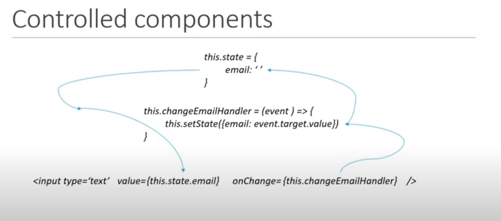

### Steps to turn a normal HTML element to controlled Component in Form:

- First initialize the state in the component.

* Second Assign the value attribute of the HTML element with state of the component.

* Finally, Assign the onChange eventHandler with setState method and update the state with the onChange event.

* Below is the example for controlled component ( Normal HTML input to React Controlled Component in a Form )

### Form.js :

```
import React, { Component } from "react";

class FormComponent extends Component {
  constructor(props) {
    super(props);
    this.state = {
      userName: "",
    };
  }

  userNameChangeHandler = (event) => {
    this.setState({
      userName: event.target.value,
    });
  };

  render() {
    const margin = { marginRight: "10px" };
    return (
      <div>
        <h1>Form Component</h1>
        <form>
          <div>
            <label style={margin}>Enter userName</label>
            <input
              type="text"
              value={this.state.userName}
              onChange={this.userNameChangeHandler}
            />
          </div>
        </form>
      </div>
    );
  }
}

export default FormComponent;

```

### Submitting Form :

- Submit a Form with a submit button which has type attribute set with submit key. Also add the onSumit event Handler in Form tag and write the logic of form Submission in that event handler method.

* Also wrie the `event.preventDefault()` method while handle the logic for form submission. It will avoid the default behaviour of the submit button which automatically set the values to initial. After called the event.preventDefault() method , there is no problem.

### Form.js :

```
import React, { Component } from "react";

class FormComponent extends Component {
  constructor(props) {
    super(props);
    this.state = {
      userName: "",
      comments: "",
      topic: "React",
    };
  }

  userNameChangeHandler = (event) => {
    this.setState({
      userName: event.target.value,
    });
  };

  commentsChangeHandler = (event) => {
    this.setState({
      comments: event.target.value,
    });
  };

  topicChangeHandler = (event) => {
    this.setState({
      topic: event.target.value,
    });
  };

  handleSubmit = (event) => {
    event.preventDefault();
    console.log(
      "values : ",
      this.state.userName,
      this.state.comments,
      this.state.topic
    );
  };

  render() {
    const marginRight = { marginRight: "10px" };
    const marginTop = { marginTop: "20px" };
    return (
      <div>
        <h1>Form Component</h1>
        <form onSubmit={this.handleSubmit}>
          <div>
            <label style={marginRight}>Enter userName</label>
            <input
              type="text"
              value={this.state.userName}
              onChange={this.userNameChangeHandler}
            />
          </div>
          <div style={marginTop}>
            <label style={marginRight}>Enter Your Comments </label>
            <textarea
              type="text"
              value={this.state.comments}
              onChange={this.commentsChangeHandler}
            ></textarea>
          </div>
          <div style={marginTop}>
            <label style={marginRight}>Topics</label>
            <select value={this.state.topic} onChange={this.topicChangeHandler}>
              <option value="React">React</option>
              <option value="Angular">Angular</option>
              <option value="Vue">vue</option>
            </select>
          </div>
          <button style={marginTop} type="submit">
            Submit
          </button>
        </form>
      </div>
    );
  }
}

export default FormComponent;

```

# Component life-cycle methods :

- When we create a component in React application, the component goes through several stages in it's lifecycle.

* React provides us build-in methods to override at the particular stages in the life-cycle.

* Life-cycle methods are not available for functionalComponents. LifeCycle methods are only for Class Components.

## Classification of Life cycle methods:

- The life cycle methods are classified into four categories as below:

  - Mounting

  * updating

  * Unmounting

  * Error Handling

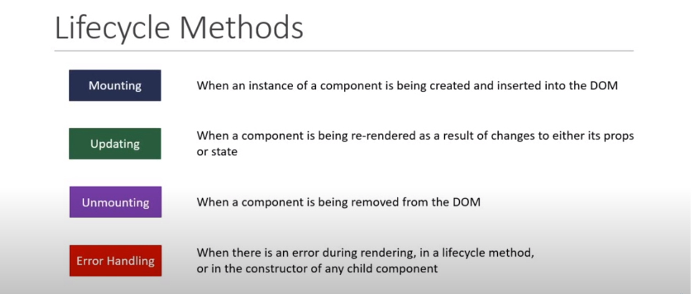

- Mounting state has 4 methods.

- Updating state has 5 methods.

* unmounting state has 1 method.

* Error handling state has 3 methods.

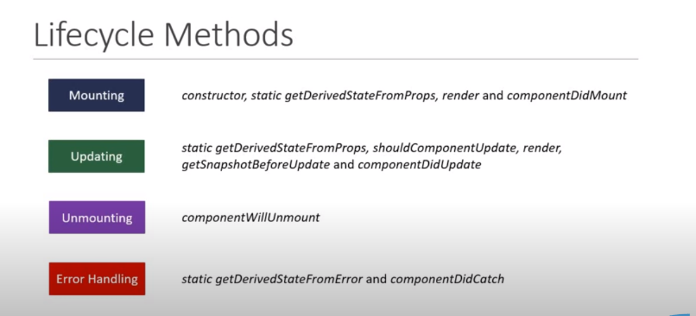

# mounting life cycle methods :

- Mounting life cycle methods are methods which are called when an instanceof an component being created and inserted into the DOM.

## 1) constructor :

- Constructor is a special function will get called whenever a component is created.

* The constructor is used for initalizing state or binding the eventhandlers to the class instance.

* We should not make HTTP request in constructor.

* While defining the constructor the below points must be considered:

  - We need to call the special function `super(props)`. This super() will call the base class constructor.In our component, If we want access for `this.props`, It is only possible after we call the super() in constructor by passing the props as argument to it like `super(props)`.

  * Constructor is the only place where we expected to set/change the state using `this.state`. For remaining areas except constructor we must use `setState method` to handle the state.

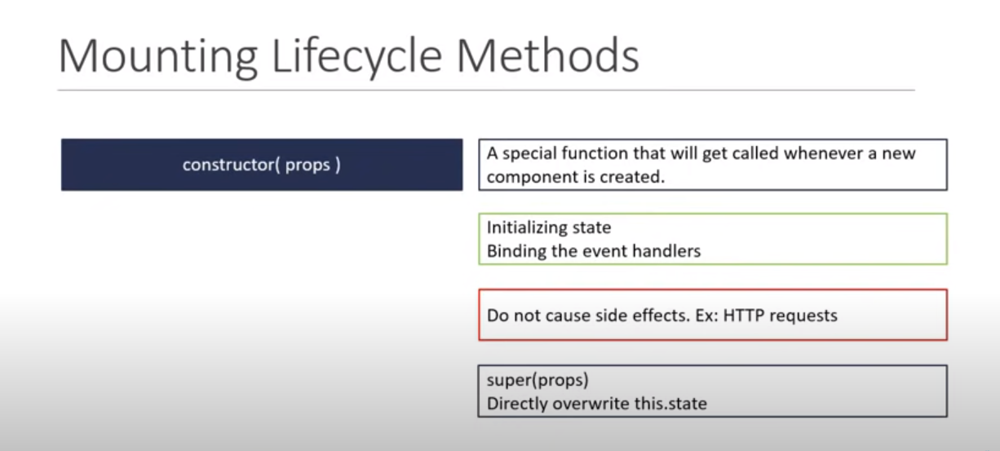

## 2 ) getDerivedStateFromProps( props,state ) :

- This method is rarely used life cycle method.

* getDerivedStateFromProps() method is used when the state of a component deponds on changes in props over time.

* Consider that we have a component.And the inital state of a component deponds on the props passed to the component. In such situations, this method is used to set the state.

* Since this method is a static method, this does not have the access to use `this` keyword. So, we cannot access the `this.setState()` method inside this particular getDerivedStateFromProps() method. Instead of calling the this.setState() method, we should return an object that represents the new state of the component.

* We should not call endpoints/http request/fetching data.

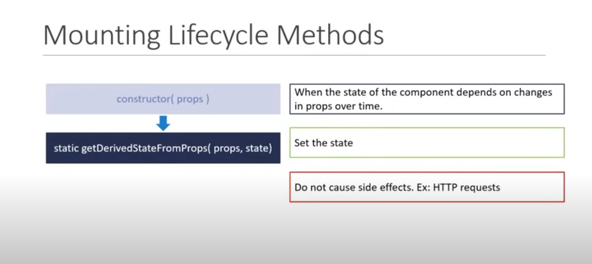

## 3) render method :

- render method is the only required method in a class component.

* In this render method we simply read `this.props` and `this.state` and return JSX which describes the UI.

* We should not change state or interact with DOM or Make AJAX calls in the render method.

* Since render method returns the JSX which may also have the children components, the children components life cycle methods are also be executed with in this render method.

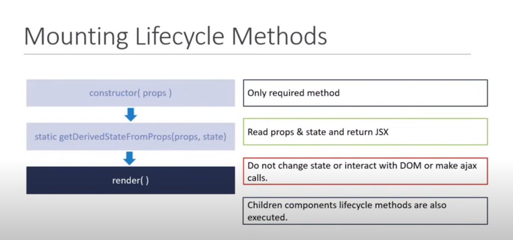

## 4) componentDidMount method :

- This is the final method in the Mounting face of component life cycle.

- This method will be called only once in the whole life cycle of a component and it is invoked immediately after a component or it's children components have been rendered to the DOM.

* This method is the perfect place to cause side effects. For example, to interact with the DOM or perform AJAX calls to load data this method is perfect.

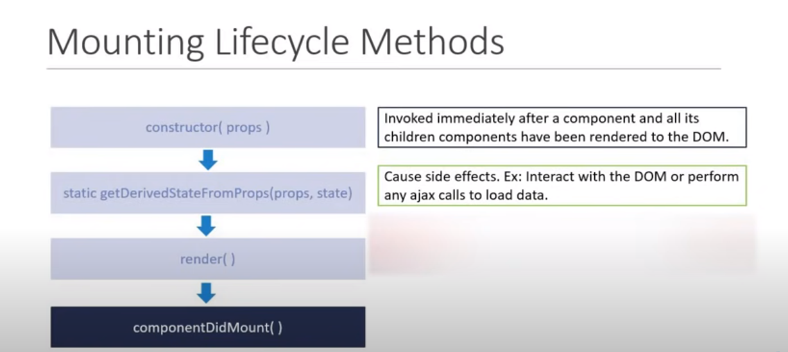

## Order of Execution of Mounting stage life cycle methods:

- let us have a class component and create every life cycle methods in Mounting stage and identify the order of executions:

### LifeCycleA.js :

```
import React, { Component } from "react";

class LifeCycleA extends Component {
  constructor(props) {
    super(props);

    this.state = {
      name: "Vijay",
    };
    console.log(" LifeCycleA constructor ");
  }

  static getDerivedStateFromProps(props, state) {
    console.log("lifeCycleA getDerivedStateFromProps");
    return null;
  }

  componentDidMount() {
    console.log("LifeCycleA componentDidMount");
  }

  render() {
    console.log("LifCycleA render");
    return (
      <div>
        <h1>I am LifeCycleA component </h1>
      </div>
    );
  }
}

export default LifeCycleA;


```

- We can see the order of exceution in the console as below:


## order of execution of Mouting state methods when a component has child component :

- We can have a LifeCycleB as child component and have the same consoles as parent as below:

### LifeCycleA.js (Parent) :

```
import React, { Component } from "react";
import LifeCycleB from "./LifeCycleB";

class LifeCycleA extends Component {
  constructor(props) {
    super(props);

    this.state = {
      name: "Vijay",
    };
    console.log(" LifeCycleA constructor ");
  }

  static getDerivedStateFromProps(props, state) {
    console.log("lifeCycleA getDerivedStateFromProps");
    return null;
  }

  componentDidMount() {
    console.log("LifeCycleA componentDidMount");
  }

  render() {
    console.log("LifCycleA render");
    return (
      <div>
        <h1>I am LifeCycleA component </h1>
        <LifeCycleB />
      </div>
    );
  }
}

export default LifeCycleA;

```

### LifeCycleB.js ( Child component ) :

```
import React, { Component } from "react";

class LifeCycleB extends Component {
  constructor(props) {
    super(props);

    this.state = {
      name: "Vijay",
    };
    console.log(" LifeCycleB constructor ");
  }

  static getDerivedStateFromProps(props, state) {
    console.log("LifeCycleB getDerivedStateFromProps");
    return null;
  }

  componentDidMount() {
    console.log("LifeCycleB componentDidMount");
  }

  render() {
    console.log("LifCycleA render");
    return (
      <div>
        <h1>I am LifeCycleB component </h1>
      </div>
    );
  }
}

export default LifeCycleB;

```

- As we already discussed in render method, the child component's life cycle methods are executed after the parent component's render method. Finally the parent component's componentDidNMount() got executed.

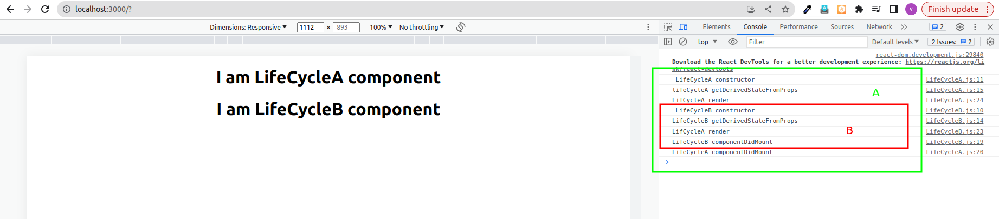

# updating life cycle methods:

- updating life cycle methods are methods being called when a component is being rerendered because of changes to either props or state.

* We have 5 methods in it. Out of 5, we have already discussed some of them.

* The methods as belows:

  - getDerivedStateFromProps( props , state ) --> Already discussed in Mounting phase itself

  * shouldComponentUpdate( nextProps , nextState )

  * render --> Already discussed in Mounting phase itself

  * getSnapshotBeforeUpdate( prevProps, prevState )

  * componentDidUpdate( prevProps, prevState , snapshot )

## 1) getDerivedStateFromProps( props , state ) :

- As we discussed earlier we can just recap as below:

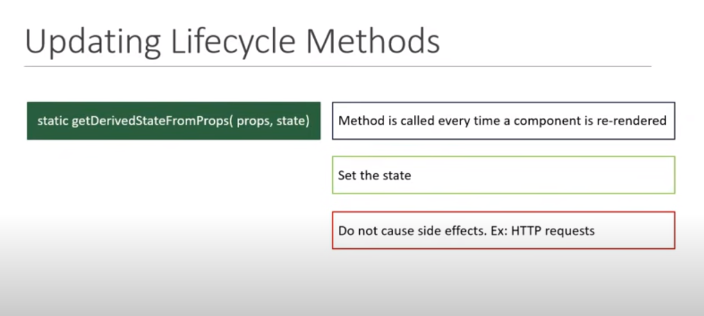

## 2 ) shouldComponentUpdate( nextProps , nextState ) :

- This method receives the updated State and props as argument.

- This method dictates if the component should re-render or not.

* By default, all class components will rerender whenever the Props they receive or state changes.

* This method can prevent the default behaviour by returning false.

* With this method , we can compare the excisiting state/props value with the next state/props value and return either true or false to let React know wheather the component should update or not.

* It is basically performance optimization.

* We should avoid causing side affects by not doing HTTP request andcalling the setState method.

* It is a rarely used life cycle method.

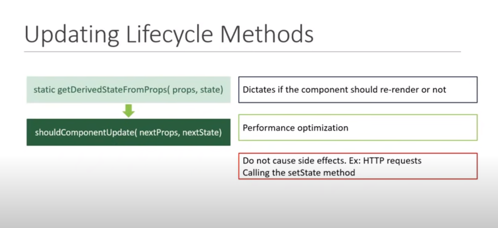

## 3 ) render :

- render method has been already discussed in mounting phase itself.

- Below image is the quick recall:

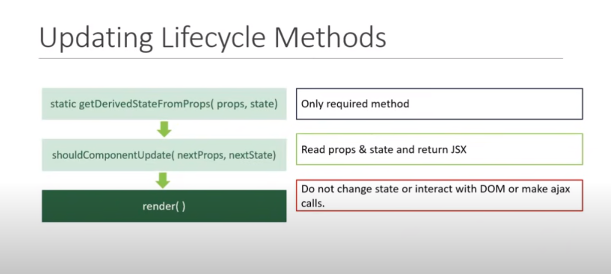

## 4 ) getSnapshotBeforeUpdate( prevprops, prevState ) :

- This method accepts prevprops and prevState as it's parameters.

- This method is called right before the changes from the virtual DOM are to be reflected in the DOM.

* It is also a rarely used method.

* This method captures some information from the DOM. For example, we can read the user's scroll position and after a update we canmaintain the scroll position by performing some calculations.

* This method either return null or retuen a value. Returned value will be passed as the third parameter to the componentDidUpdate() method.

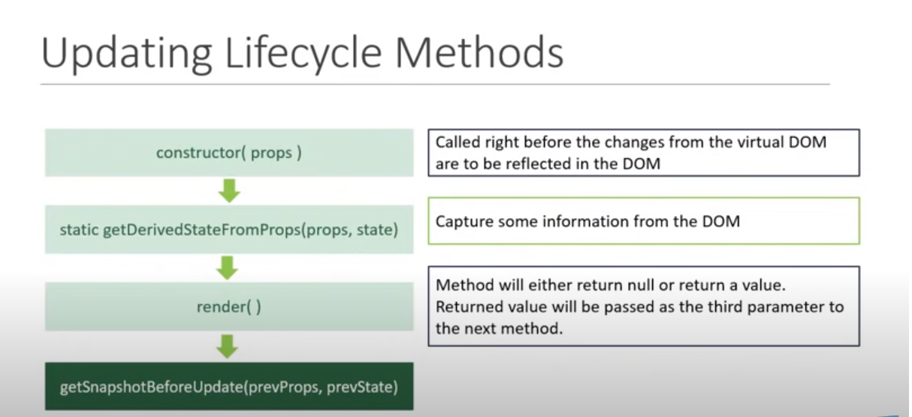

## 5) componentDidUpdate( prevProp, prevState, snapshot ) :

- This method is called when render is finished in the re-render cycles. This means that the component and the all the sub-components have properly rendered itself after the update.

* This method gets three properties like prevProp, prevState and snapshot which returned from the getSnapshotBeforeUpdate method.

* This method is guarenteed to be called only once in the re-render cycle.

* we can make AJAX calls in this method. Before make any AJAX call, we should compare the pervState and prevProps values with currentState and currentProps values to decide wheather to make AJAX calls or not. This practice avoids unwanted AJAX calls.

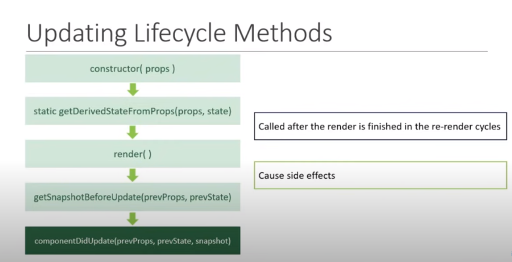

## Order of execution in update_pahse lifecycle methods:
